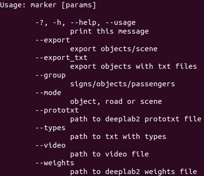
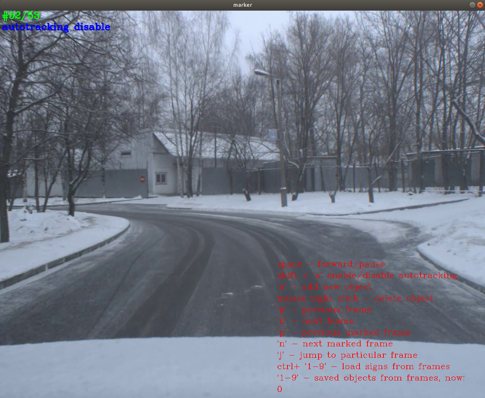
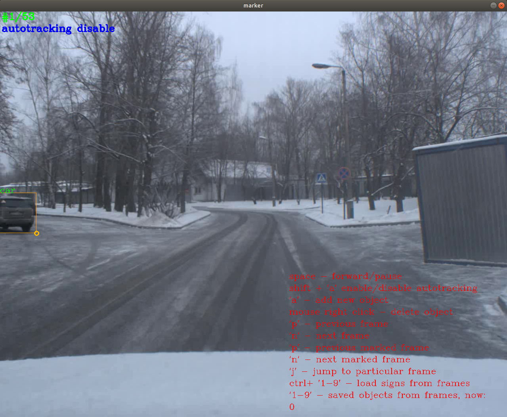
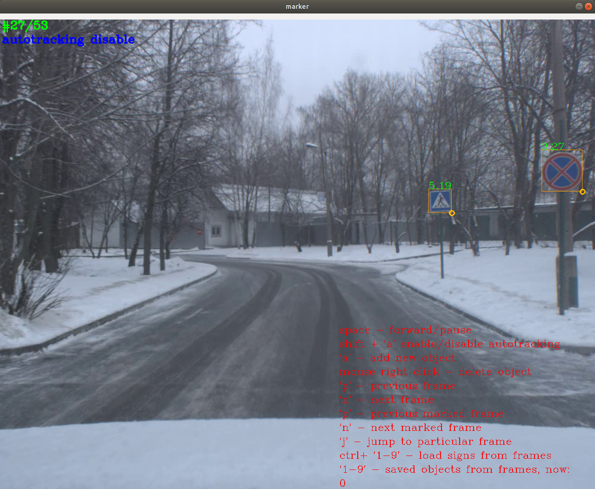
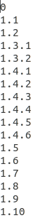
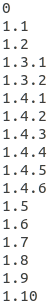

# Аннотация
Программа для определения местоположения движущихся объектов во времени с помощью opencv.

## Поддерживаемые платформы
* Linux 
  * Среда разработки Qt Creator

## Требования:
* cmake
* qt5-qmake
* OpenCV (версия 3.4.3)
* boost (не ниже версии 1.56)

## Загрузка, установка и запуск
Установку можно выполнить 2 способами:
* cmake
* qmake

### Загрузка
```
git clone https://gitlab.com/agaltsev.stas/marker.git
cd marker
```
### Установка с помощью cmake
```
cmake CMakeLists.txt
make
```
### Установка с помощью qmake
```
qmake marker.pro
make
```
### Запуск
```
cd bin/
./marker --help
```

# Описание
Программа осуществляет трекинг различных объектов (машины, пешеходы, дорожные знаки). Данные записываются в xml файлы. С помощью записанных данных можно вырезать и сохранять интересующие нас объекты.

## Запуск трекинга объектов
```
./marker --mode=object --group=objects --types=../data/objects.txt --video=../test.avi

```

## Запуск трекинга дорожных знаков
```
./marker --mode=object --group=signs --types=../data/road_signs.txt --video=../test.avi
```

## Полный список возможностей marker
<p align="center">
</p>

## Пример запуска видео
<p align="center">
</p>

## Работа с видео
<p align="center">
</p>

## Пример трекинга объектов
<p align="center">
</p>

## Пример трекинга дорожных знаков
<p align="center">
</p>

## Список объектов в objects.txt
<p align="center">
</p>

## Список дорожных знаков в road_signs.txt
<p align="center">
</p>