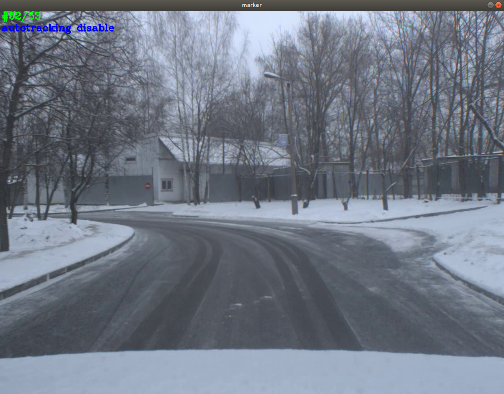

# Аннотация
Программа для определения местоположения движущихся объектов во времени с помощью opencv.

## Поддерживаемые платформы
* Linux 
  * Среда разработки Qt Creator

## Требования:
* cmake
* qt5-qmake
* OpenCV (версия 3.4.3)
* boost (не ниже версии 1.56)

## Загрузка, установка и запуск
Установку можно выполнить 2 способами:
* cmake
* qmake

### Загрузка
```
git clone https://gitlab.com/agaltsev.stas/marker.git
cd marker
```
### Установка с помощью cmake
```
cmake CMakeLists.txt
make
```
### Установка с помощью qmake
```
qmake marker.pro
make
```
### Запуск
```
cd bin/
./marker --help
```

# Описание
Запуск осуществляется командой:
```
./marker --mode=object --group=objects --types=../data/objects.txt --video=../test.avi
./marker --mode=object --group=signs --types=../data/road_signs.txt --video=../test.avi
```
```<path>``` - путь к модулям. 
После запуска происходит парсинг заголовочных файлов всех модулей по пути ```<path>```. Если у модуля нет заголовочного файла, совпадающего с именем его папки, то данный модуль не добавляется в конфигуратор. После этого открывается пользовательское окно со списком всех доступных модулей в виде кнопок.
<p align="center">
</p>

Пользователь может выбрать необходимые модули, нажав на них левой кнопкой мышки. После чего название модуля появляется в окне, а кнопка с названием модуля становится неактивной. Один модуль можно выбрать только один раз. 
<p align="center">
</p>

В окне можно перемещать модули относительно друг друга и относительно окна, зажав на модуле левую кнопку мыши. Зажав правую кнопку мыши, можно генерировать связи между модулями в виде стрелок. Зажав среднюю кнопку мыши, происходит удаление модуля в окне, а кнопка с названием модуля становится активной. После установления 1 связи между модулями кнопка "Сгенерировать yml" становится активной.
<p align="center">
</p>

После нажатия кнопки "Сгенерировать yml" открывается диалоговое окно, в котором можно задать путь и имя для сгенерированной структуры. По умолчанию это ```../struct/structure.yml```. Из выпадающего списка пользователь может выбрать свой вариант или вписать своё название файла.
<p align="center">
</p>

Если файл с таким названием уже существует, программа должна спросить пользователя, хочет ли он перезаписать уже существующий файл.
<p align="center">
</p>

Кнопка "открыть" открывает yml файл в режиме предпросмотр, где пользователь имеет возможность внести свои изменения.
<p align="center">
</p>

Пример сгенерированного yml файла представлен на рисунке ниже.
<p align="center">
</p>

Id модуля в yml файле соответствует порядковому номеру модуля. Начинается с 1. Первые три строки содержат заголовок:

```
%YAML:1.0
---
modules:
```
Перед описанием модуля пишется - (дефис). Строчками ниже описывается id модуля, его тип и служебное слово parameters. Если в модуле нет обязательных параметров, то служебное слово parameters должно быть закомментировано. Если обязательные параметры присутствуют в качестве атрибутов, то должны содержать значения по умолчанию, заданные в заголовочном файле. Значения true или false должны быть заменены соответственно 0 или 1. Перед необязательными параметрами должен располагаться заголовок: 
```
# Список необязательных параметров
```
Все необязательные параметры модуля должны быть также закомментированы, а в качестве атрибутов должны быть установлены значения по умолчанию из заголовочного файла модуля. Помимо необязательных параметров, описанных в заголовочных файлах.
После описания модулей, должны быть описаны связи между модулями, соответствующие стрелкам, поставленным пользователем при конфигурации yml файла. Описание связей начинается с заголовка:
```
links:
```
Перед каждой новой парой связей ставится - (дефис). На следующих строках указывается модуль источник и модуль приёмник при помощи служебных слов from, to. 
Порядок установки связей соответствует порядку расположения модулей. Сначала описываются все связи, выходящие из первого модуля, потом из второго и так далее. Если в конфигураторе пользователь не назначил модулю связей, в yml файле связи для него также не прописываются. 
